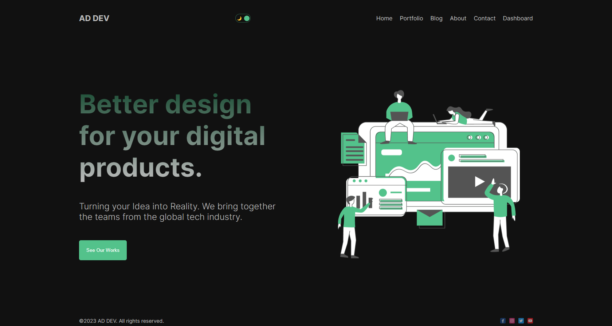
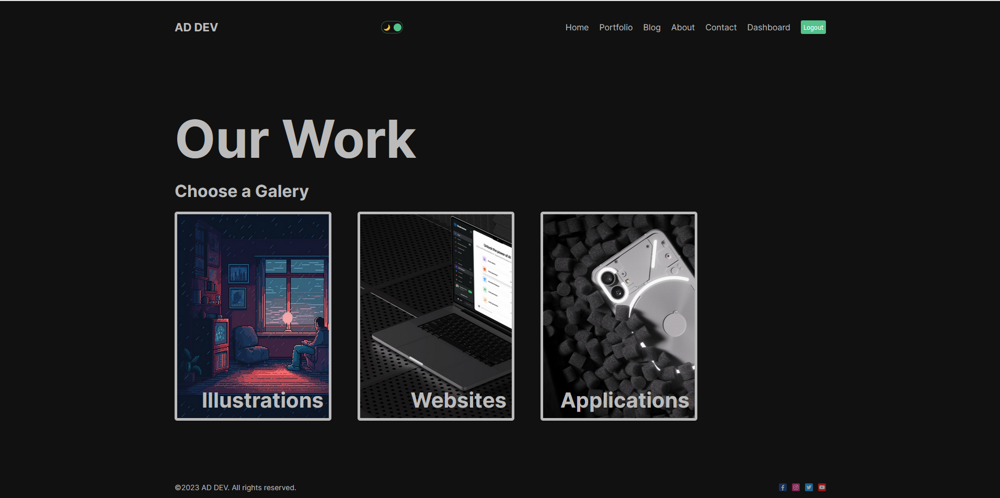
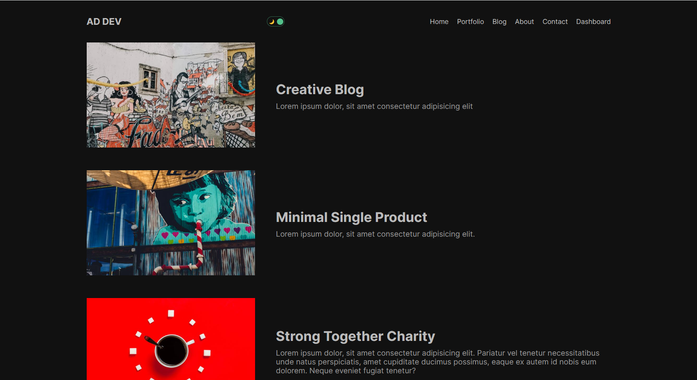
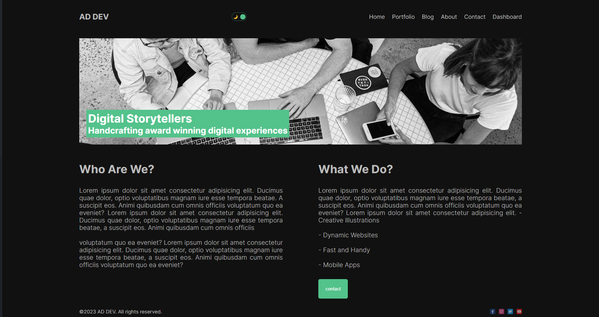
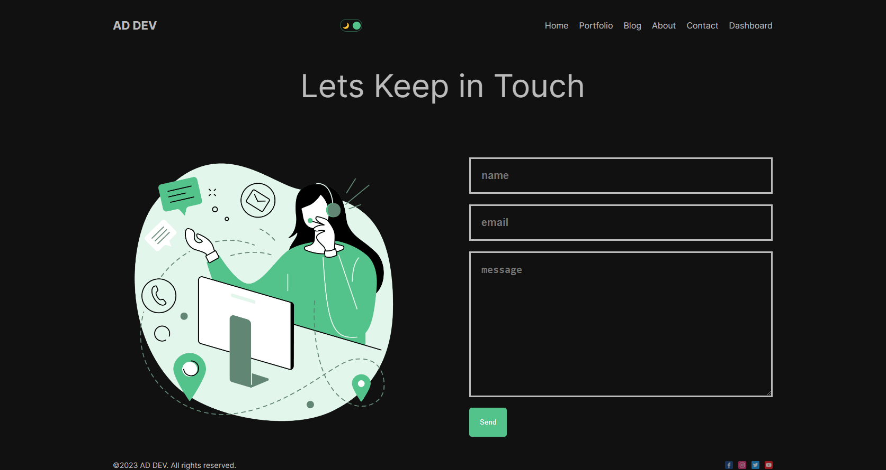
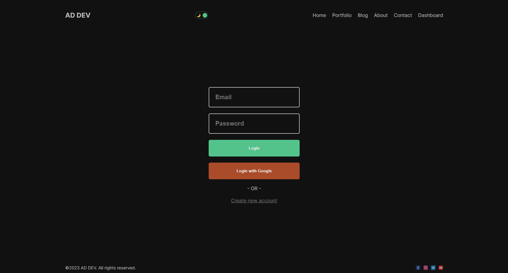
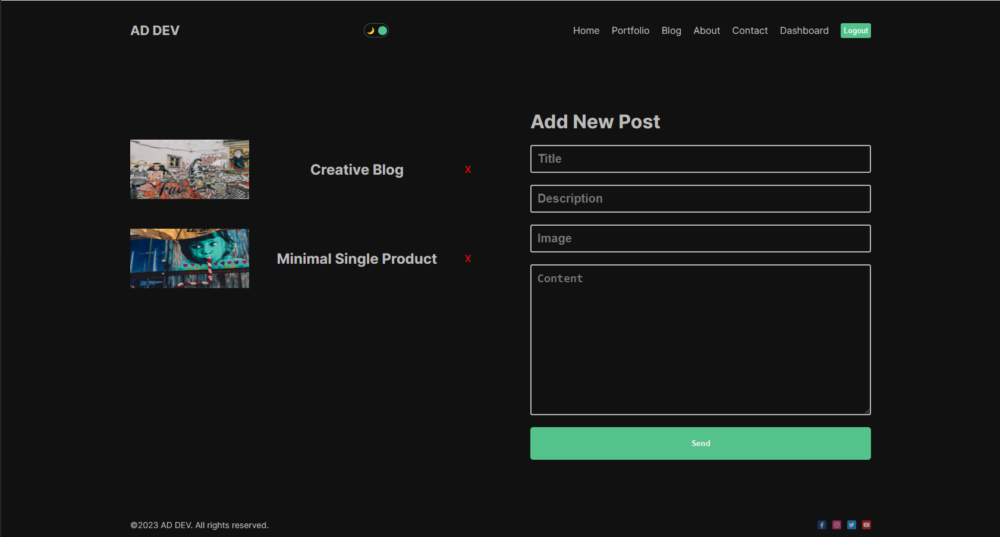

# Next.js Fullstack Application

 Next.js Fullstack Application. It inlcudes home, postfolio, blog, about, contact and dashboard pages. These pages were created using Next.js app router. This app uses MongoDB  database. There is a dark mode toggle button. Context API is used for dark mode and light mode. NextAuth.js is used for Authintication. Users can register, create a new account, and login with user credentials or login using Google account. After login users will see the protected dashbaord that shows the user's posts and will be able to add new posts. Users can delete their own posts.

 You can see the website [here](https://nextjsblog2.netlify.app)

 To run the application

1. Clone this repo
2. Run `npm install`
3. Run `npm run dev`

Open [http://localhost:3000](http://localhost:3000) with your browser

## Built With

* HTML
* CSS
* Javascript
* Next.js
* MongoDB / Mongoose
* NextAuth.js
* Google Cloud as auth provider
* bcryptjs
* Context API

 

## Environmental Variables

### MongoDB URL

In `src/utils/db.js` replace `process.env.MONGO` with your MongoDB url 

 

### BASE URL
Replace `process.env.BASE_URL` with the api base url in:

* `src/app/blog/page.jsx`

Example: `http://localhost:8800/api`

 

### Google Cloud Auth

In `src\app\api\auth\register\route.js` Add the Client ID `GOOGLE_CLIENT_SECRET` and Client secret `GOOGLE_CLIENT_SECRET` from Google cloud Credentials in APIs & Services 

for more information:

* [Next Auth.js Google Provider](https://next-auth.js.org/providers/google)
* [Google Cloud APIs Credentials](https://console.developers.google.com/apis/credentials)
* [Using OAuth 2.0 to Access Google APIs](https://developers.google.com/identity/protocols/oauth2)

Also you need to add your server URI in Authorized JavaScript origins (for example http://localhost:8800) in Google cloud web application  

 

### NEXTAUTH_SECRET

Used to encrypt the NextAuth.js JWT, and to hash email verification tokens. This is the default value for the secret option in NextAuth and Middleware.

For more information
* [Auth.js OAuth authentication - Configuring Auth.js](https://authjs.dev/getting-started/oauth-tutorial#1-configuring-authjs)
* [NEXTAUTH_SECRET](https://next-auth.js.org/configuration/options#nextauth_secret)

`NEXTAUTH_SECRET="This is an example"`

 

###  NEXTAUTH_URL 

When deploying your site, you need to set the NEXTAUTH_URL environment variable to the canonical URL of your website:

`NEXTAUTH_URL=https://example.com`

For more information
* [Auth.js OAuth authentication - Deploying to production](https://authjs.dev/getting-started/oauth-tutorial#4-deploying-to-production)

 

## Deployment

Deployed on [Netlify](https://netlify.com)
You can see the website [here](https://nextjsblog2.netlify.app)

 

## Authors

- **Ali Darraji** - [https://github.com/adarraji](https://github.com/adarraji)

 

## Deploy status

 

## Screenshots
 

 
 

 
 

 
 

 
 

 
 

 
 

 
 

 
 
 
